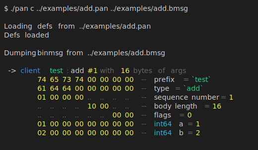

# `libPan` -- Анализатор трафика в формате `binmsg`
_Дидык Иван, 2026-04-12_



_Отдельно работающий анализатор, бинарный формат_

Данный анализатор предназначен, чтобы писать логи общения клиентов данной игры с сервером.
Общение происходит в формате `binmsg`. Он поддерживает описания протоколов в текстовом виде
(можете глянуть в `examples/`).

Также этот инструмент умеет генерировать заголовочники, чтобы эти сообщения удобно
декодировать/закодировать программой.

## Сборка

Данный проект использует `cmake >= 3.10`.

```sh
$ cmake -B build
$ cd build/
$ make
```

Экспортируется статическая библиотека `libPan`.
Также собирается отдельный исполняемый файл `pan`, который
может парсить сохранённые в файл дампы.

## Использование библиотеки

Самый простой вариант использования такой:

```c
struct PAN pan;

// Инициализируем
// logger = NULL -> будет писать в stderr
// color  = true -> вывод цветной
pan_init(&pan, NULL, true);

// Загружаем описания протокола
// Есть ещё pan_loadDefs(), который из строки грузит
// Можно запускать вызывать угодно раз, новые дописываются в начало
if (!pan_loadDefsFromFile(&pan, "./myproto.pan")) {
    // Ошибка, что-нибудь делаем
    perror("Failed to load protocol defs");
    exit(-1);
}

// Дампим сообщение msg размера msg_size,
// пришедшее от клиента. Выведет ошибку, если сообщение не полное.
// Если у сообщения лишние данные в конце, ничего не выведет.
// Вернёт сколько байт было взято из буффера.
size_t taken = pan_binDump(&pan, PAN_CLIENT, msg, msg_size);

// Уберёмся за собой
pan_destroy(&pan);
```

## Формат спецификации протоколов

Протоколы специфицируются в файлах с расширением `.pan`. 
Формат поддерживает однострочные комментарии, начинающиеся с `#`,
и кроме комментариев не чувствителен к переносам строк и пробелам.

Описание формата сообщения выглядит так:

```
client adder:add(int64 a, int64 b);
```

Первое слово -- сторона с которой приходит сообщение. Это `client`/`server`.
Затем префикс и тип. Затем аргументы. Аргументы могут не иметь имени, но
это не очень рекомендуется.

Поддерживаемые типы:

 - `id` - по сути `uint32`
 - `char64` - строка из 8 `char`-ов
 - `int8`, `int16`, `int32`, `int64` - знаковые числа
 - `float`, `double` - числа с плавающей точкой
 - `string`, `blob` - `u16` длинна + данные

Структур нет, массивов нет. `typedef`-ов тоже нет (но они не помешали бы).

Префиксы и типы могут быть любые, но только 8 байт в длинну. При генерации
заголовочников все не букво-численные символы в них заменяются на `_`.
Так что лучше использовать валидные названия в C.

Аргументы при генерации заголовочников используются напрямую, так что используйте
валидные в C имена.

## Заголовочники

Теперь данная программа генерирует заголовочники. Выглядят они вот так:

```c
#pragma once
#include "pan-bmsg-macros.h"

PAN_GH_DEFS_BEGIN

PAN_GH_MSG(PAN_GH_CLIENT, test, add, "test", "add",
    int64_t          a;
    int64_t          b;
)
PAN_GH_DECODE(PAN_GH_CLIENT, test, add, "test", "add",
    PAN_GH_READ(&self->a, sizeof(self->a));
    PAN_GH_READ(&self->b, sizeof(self->b));
)
PAN_GH_ENCODE(PAN_GH_CLIENT, test, add, "test", "add",
    uint16_t len = 0;
    len += sizeof(self->a);
    len += sizeof(self->b);
    PAN_GH_HEADER("test", "add", len);
    PAN_GH_WRITE(&self->a, sizeof(self->a));
    PAN_GH_WRITE(&self->b, sizeof(self->b));
)

// ... ещё другие сообщения

PAN_GH_DEFS_END
```

Как видите, это большой слой макросов, с помощью которого можно
сделать хоть декодер этого из под плюсов со `string_view` и потоками, хотя на `c`
с файловыми дескрипторами.

Используемые макросы таковы:

 - `PAN_GH_BEGIN` & `PAN_GH_END` -- окружают все определения, можно сделать там `namespace`
 - `PAN_GH_MSG`, `PAN_GH_DECODE` и `PAN_GH_ENCODE` -- макросы для генерации структурки сообщения,
   методов для его закодирования/декодирования. Берут две версии префиксов и типов:
   С-пригодную и оригинальную строковую.
 - `PAN_GH_ID`, `PAN_GH_CHAR64` и `PAN_GH_SLICE` -- типы для `id`, `char64` и `text`/`blob` соответственно
 - `PAN_GH_READ(&buf, size)` - читает данные в данный буффер, `PAN_GH_WRITE` - пишет.
 - `PAN_GH_READ_SLICE(&slice, len)`, `PAN_GH_WRITE_SLICE(&slice, len)` -- то же самое, только для текста/блобов.
 - `PAN_GH_HEADER()` -- пишем заголовок сообщения
 - `PAN_GH_CLIENT` и `PAN_GH_SERVER` -- первый аргумент, укзывает, для кого сообщение.

По умолчанию используется заголовочник `pan_cxx_macros.hpp`.

Пример использования данной системы можно увидеть в `examples/add.cpp`, сборку в `CMakeLists.txt`.

## Что ещё можно доделать

 - Ожидаемые ответы -- на одно сообщение ожидаемо, что последует другое в ответ.
 - `typedef`-ы
 - Ещё какие-нибудь типы?
 - Обработка ошибок вокруг `fseek/...`.
